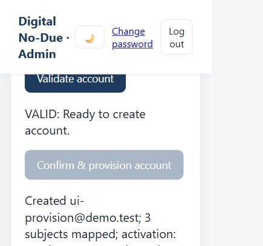

# College provisioning: architecture, testing and deployment

## Architecture and account workflow

The existing vanilla-JavaScript/Firebase Auth/Firestore application and No-Due workflow remain. The normal admin dashboard now uses `institutionalAdmin`, a second-generation callable Cloud Function in `us-central1`. Firebase verifies the caller token; every backend operation checks an existing, enabled Auth account and its admin Firestore role. Firebase Admin SDK is confined to `functions/` and explicitly emulator-only helpers. No service-account key was created or placed in frontend code.

Advanced UID editing and legacy upgrade remain in `advanced-admin.html`. Teacher rosters still query active enrollments by offering and teacher, and marks remain keyed by student UID plus offering ID. Scheme is added to student profiles; department, scheme, active and optional credits extend offerings. Old records remain compatible; nothing automatically migrates/deletes legacy records.

New backend-owned collections are `uniqueIdentities/{kind}_{hash}` (transactional identity reservations) and `provisioningJobs/{generatedUid}` (caller/input digest/retry state/result/activation status). No plaintext password or reset link is stored in either collection. `settings/institution` holds allowed domains, departments, sections and non-secret SMTP settings.

Normal operation:

1. Bootstrap the first admin once in Auth and `users/{actualUid}` using Firebase Console; existing valid admins need no migration.
2. Configure actual allowed college domains, departments and sections. ISE and Information Science & Engineering normalize to ISE.
3. Enter an account or upload student CSV; validate and review VALID/WARNING/ERROR rows. Critical errors cannot be imported. Missing active class setup is a warning: a profile can be created, but clearance remains unprepared.
4. Confirm the reviewed import. Backend revalidates, reserves unique email/USN/employee ID, creates Auth, obtains UID, and writes linked user/student profiles.
5. Mentor is resolved by email, employee ID or optional UID. Multiple provided identifiers must identify the same mentor.
6. Automatically enroll in active offerings matching **department + scheme + semester + section**, with at most 30 subjects/student, and prepare No-Due mappings. Existing requests retain historical approvers.
7. Production creates a random unknown initial password, generates a Firebase password-reset link, and sends activation through configured institution SMTP. The recipient chooses their own password. Emulator-only provisioning uses DemoPassword123!.
8. Report account creation, mentor/subject mappings and activation separately. Delivery failure preserves the account and reports `delivery-failed`; account search offers **Retry activation email**. The user can also use Firebase's standard Forgot Password email.

Stable request IDs let the same import row resume after partial failure without creating another account or deleting it. Operation IDs remain available for retries while the import page stays open. After a page reload, search/review the existing account/job rather than assigning a new operation to the same identity. Production never enables demo credentials or demo.test.

## CSV templates and source policy

Student template: `templates/student-import.csv`

```csv
name,usn,collegeEmail,phone,department,semester,section,scheme,mentorEmail,mentorEmployeeId,mentorId
```

Provide one or more consistent mentor identifiers; no UID is required. Phone can be blank. USNs support realistic formats such as 1AY24IS183. Staff provisioning requires name, college email, department, role and faculty/employee ID; teaching subjects/sections derive from offerings.

Offering template: `templates/offering-import.csv`

```csv
department,scheme,semester,section,subjectCode,subjectName,teacherEmail,credits,components,active
```

`components` is a CSV-quoted JSON array, for example `[{"id":"ia1","label":"Internal Assessment 1","max":30}]`. Double each JSON quote when placing it in CSV. Assessment maxima are institutional configuration, not inferred from timetable data. Blank credits mean unknown. Teacher email must resolve to an existing faculty/mentor account; missing teachers are flagged rather than silently created. Deterministic IDs prevent duplicate subjects/offerings. Bulk import refuses changing an existing offering's teacher/assessments; use advanced editing and explicit plan refresh for those corrections.

Preview requests process 100 rows/chunk, display 50 preview rows/page and allow up to 2 MB/2,000 uploaded rows. Duplicate checks also span chunks. Accounts run sequentially with progress and per-row errors. Existing-student auto-enrollment uses indexed class queries and 20-student pages. Result CSV reports name, USN, email, section, account created, academic mapping created, mentor mapped, subjects mapped, activation and errors/warnings. `.csv.txt` copies provide browser downloads without deploying uploaded/private CSV files.

The user confirmed ISE / 2022 / Semester 5 / C:

| Code | Exact confirmed name |
| --- | --- |
| BCS501 | Software Engineering & Project Management |
| BCS502 | Computer Networks |
| BCS503 | Theory of Computation |
| BCS515B | Unix System Programming |
| Unconfirmed | Research Methodology & IPR |
| Unconfirmed | Mini Project |
| Unconfirmed | Environmental Studies / EVS |

`templates/ise-5c-2022-confirmed.csv` contains these values. Faculty names/emails, three missing codes, credits and assessment structures are left unfilled; incomplete rows cannot be imported. No timetable faculty or code was invented. The 50-student scenario uses the preserved **synthetic** CS501 DBMS/CS502 Java/CS503 OS fixture in separate ISE offerings, and does not claim those faculty mappings are the official timetable master.

## Password flows

Login's Forgot Password form calls `sendPasswordResetEmail` with the registered Auth email and shows “If an account exists for this email, a password reset link has been sent.” Missing-account errors use the same message. Useful invalid-email/network/rate-limit messages do not expose account existence. This applies to every role.

Logged-in pages and academic profiles link to Change Password. The client asks for current/new/confirmation passwords, reauthenticates using the current credential, then calls `updatePassword`. Recent-login errors explain signing out/in and retrying. Admin cannot read passwords. A missing/unknown institutional profile now produces the requested useful error and signs that incomplete session out.

Emulator reset links appear in the Auth terminal; no real email is sent. Automated tests retrieve the emulator OOB code, reset, sign in, reauthenticate and change the password. Browser tests cover the reset form/message; new password entry/submission was tested through the SDK, not browser automation.

## Exact local commands

One-time dependencies:

```powershell
cd "C:\Users\Hp\Desktop\College Projects\Digital-No-Due-Form\functions"
npm ci
cd "C:\Users\Hp\Desktop\College Projects\Digital-No-Due-Form\tests"
npm ci
```

Terminal A (skip if the current expanded demo is running):

```powershell
cd "C:\Users\Hp\Desktop\College Projects\Digital-No-Due-Form\tests"
npm run preview
```

Wait for all emulators and institutionalAdmin to be ready. Main ports: Auth 9199, Firestore 8180, Functions 5001, Hosting 5050, UI 4500. Preview exports on normal shutdown to `local-emulator-backup/current` and imports it on restart. Forced termination can still lose changes since the last export.

Terminal B, for a new demo:

```powershell
cd "C:\Users\Hp\Desktop\College Projects\Digital-No-Due-Form\tests"
npm run seed
npm run seed:bulk
npm run verify:demo
Start-Process "http://127.0.0.1:5050/login.html?emulator=1"
```

Original seed resets its known academic fixture and preserves requests/notifications; do not run it during a marks walkthrough. Bulk seed preserves existing synthetic student profiles/marks and refuses identity conflicts. It generates `templates/demo-students-50.csv` and an ignored local result report; it does not overwrite an existing personal/college USN.

All automated tests use isolated ports/project so the browser demo is not cleared:

```powershell
cd "C:\Users\Hp\Desktop\College Projects\Digital-No-Due-Form\tests"
$env:FUNCTIONS_DISCOVERY_TIMEOUT='60'
npm run audit
```

Audit: demo-digital-no-due-audit, Auth 9200 / Firestore 8181 / Functions 5002 / hub 4411. If an audit emulator is already running, use `npm run test:all` instead. The legacy `npm test` clears the default demo Firestore; prefer audit for this extension. On Windows, verify an orphan Java process belongs to the isolated audit before stopping it.

Explicit main-demo snapshot while running:

```powershell
npx firebase emulators:export ../local-emulator-backup/current --project demo-digital-no-due --config ../firebase.json --force
```

## Demo credentials and professor walkthrough

All passwords: **DemoPassword123!**.

| Purpose | Email |
| --- | --- |
| Admin | admin@demo.test |
| Original Asha/Ravi | student@demo.test / student2@demo.test |
| C DBMS/Java/OS faculty | subject_faculty@demo.test / java_faculty@demo.test / os_faculty@demo.test |
| Synthetic A/B faculty | ise-ab-faculty@demo.test |
| Mentor | mentor@demo.test |
| HOD/office | hod@demo.test / office@demo.test |
| Service desks | library@demo.test / physics_lab@demo.test / chemistry_lab@demo.test / accounts@demo.test |
| 50 synthetic students | ise-demo-1ay24is101@demo.test through ise-demo-1ay24is150@demo.test |
| Browser-created smoke-test student | ui-provision@demo.test, USN DEMOUI001 (not part of bulk seed) |

Sections repeat 101=A, 102=B, 103=C; A=17/B=17/C=16. The independent UI smoke-test adds another C student, and the original Asha/Ravi fixture remains.

1. Admin: show institution policy and CSV without UIDs, validation/preview, progress and results. Demonstration has 50 generated accounts and nine synthetic offerings.
2. Provision another synthetic account using ISE/2022/5/C and mentor@demo.test; show generated UID and automatic three-subject mapping.
3. C DBMS teacher: open Classes & Marks and choose the ISE C offering. Find 1AY24IS103 and 1AY24IS106; both are enrolled, A/B students are absent from this class.
4. Enter different marks, update 103 again, verify 106 is unchanged. Initial unentered marks are shown as unentered, not fabricated grades.
5. Student ise-demo-1ay24is103@demo.test: show own profile/scheme/mentor/subjects/staff/assignments/marks; they cannot change marks or read another student's records.
6. Mentor: show all imported mentees, paginated beyond 30.
7. Sign out; demonstrate Forgot Password and the emulator reset link. The person testing the browser completes password changes; SDK tests already verify both password flows.
8. Create No-Due; confirm three faculty plus four services. Follow LOCAL-DEMO.md for rejection, private notification, resubmission and Stage 1 → Mentor → HOD → Office.
9. Admin: preview the confirmed ISE source CSV and show that unknown faculty/codes are errors and import remains disabled. Fill blanks only from confirmed source data.

## Production deployment — documented, not executed

Use the existing `digital-no-due-shayan` project and web configuration, bootstrap/verify the college admin, enable Email/Password Auth, and configure actual authorized domains/password policy. Cloud Functions deployment requires Blaze billing; emulator use does not require deploying or sending paid email. See [Firebase setup](https://firebase.google.com/docs/functions/get-started).

Use Node 22 for the deployed runtime and install locked functions/test dependencies. Configure the actual institution SMTP account/provider; the password is a Secret Manager secret, never a frontend/Firestore/CSV value:

```powershell
cd "C:\Users\Hp\Desktop\College Projects\Digital-No-Due-Form\tests"
npx firebase login
npx firebase projects:list
npx firebase functions:secrets:set SMTP_PASSWORD --project digital-no-due-shayan
npx firebase deploy --project digital-no-due-shayan --config ../firebase.json --only firestore:rules,firestore:indexes
npx firebase deploy --project digital-no-due-shayan --config ../firebase.json --only functions:institutional
npx firebase deploy --project digital-no-due-shayan --config ../firebase.json --only hosting
```

The secret command prompts for its value. Wait for indexes to build. In Admin set actual domains/departments/sections, SMTP host, port 465/587, username and sender. Production rejects demo.test. Provision staff first; set service/HOD/office assignments in Advanced editing; import confirmed offerings with existing faculty; then import students by mentor email/employee ID. Verify one actual activation delivery before a large import. No live deployment, email delivery or data migration was executed by Codex.

Custom activation delivery needs institution SMTP or another SMTP provider; fees depend on that provider. Firebase standard Forgot Password does not use our SMTP provider. See [Firebase action links](https://firebase.google.com/docs/auth/admin/email-action-links) and [Secret Manager configuration](https://firebase.google.com/docs/functions/config-env).

## Security, indexes and verification

Browser writes to uniqueIdentities/provisioningJobs are denied; trusted backend owns them, admin can read them. Institution policy is admin-only. Marks additionally enforce offering department/scheme when present. Existing scoped reads, immutable/private notifications, role protection, read-only student marks and atomic approval rules remain.

Committed indexes add active enrollment queries by student/offering/teacher, offering matches by department/scheme/semester/section/active, and student pagination by department/scheme/semester/section; existing workflow indexes remain. Email/USN/facultyId/role lookups use default single-field indexes.

2026-10-04: **26 tests passed** (19 workflow/security/roster + 7 provisioning/password). Coverage includes 50 Auth-created students across three sections, automatic UID/enrollment/mentor linking, roster isolation, independent marks, own-only academics, No-Due mapping, late offering enrollment, duplicates/CSV errors, forgot/change password, no plaintext password in Firestore and simulated production activation failure entirely inside emulators. Existing 305-student/100-teacher tests still pass.

Browser checks passed for generic reset status, admin validation/provisioning with three subjects and blocked incomplete source CSV. Real SMTP delivery, deployed Functions runtime, production indexes and timetable faculty mappings remain unverified until the college supplies/configures them.



The explicit local snapshot was verified to contain 65 Auth accounts plus Firestore export metadata/data. On this Windows Node 24 environment the CLI reported Export complete and then exited with a libuv assertion; the actual export files were separately verified. Current demo emulators are left running. Existing in-memory state from the earlier session was unavailable after that session stopped; the documented synthetic fixtures were recreated. No production state was read or written.
