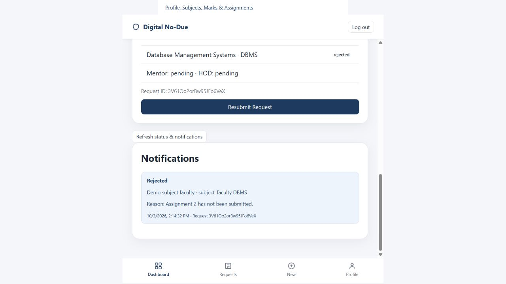

# Validation

Automated verification uses the actual production academic/admin/workflow modules with a test-only ES-module loader that swaps browser Firebase imports for the installed Firebase SDK and injects authenticated local emulator contexts. Firestore Security Rules are loaded from the committed rules file, compiled and executed by the real emulator. Auth login tests use Firebase Authentication Emulator and signed-in Firestore reads. All fixtures use `demo-digital-no-due`, never the configured production project.

Latest completed expanded run: **18 tests passed, 0 failed**. Expected permission-denied output is part of denial tests. The JavaScript syntax checks pass. Tests exercise multiple assertions each; test count differs from the requested scenario count.

| Requested scenario | Evidence |
| --- | --- |
| 1, 8, 13: student/teacher/mentor login | Auth emulator creates accounts, signs out/in, reads correct own role; browser smoke checks documented below |
| 2–6: automatic student profile/mentor/subjects/marks/assignments | Production academicDetails reads linked profile, mentor, teacher, scores and assignment fixtures |
| 7: student cannot edit marks | Direct SDK writes denied for owning student and unrelated student |
| 9–10: teacher profile and assigned students | Own role/profile reads; scoped offerings/enrollment queries return only assigned class; unrelated student profile read denied |
| 11–12: own-subject marks, reject other teacher | Production saveMarks creates/updates valid scores; cross-teacher, section, ownership, range and unauthorized component writes denied |
| 14–15: mentor scope and mentee details | Scoped mentee query; unrelated mentor read and whole-directory query denied; current mentor reads marks; assigned teacher/mentor dual-role case tested |
| 16–17: automatic request and approvers | Production submitRequest copies trusted profile and five required approvers; forged owner and omitted plan denied |
| 18–22: teacher approval/rejection/reason/isolation/resubmit | Actual workflow operations, stored reason/subject/actor event, other-student notification denial, rejected item reset |
| 23–28: Stage 1 → mentor → HOD → office | Full actual chain with mentor/HOD rejection and stage-specific resubmission; wrong office and premature HOD operation denied |
| 29: private notifications | Owner-only reads; one immutable notification per committed version; reason preservation verified |
| 30: service desks | Library, both labs and accounts use production approval function and advance remaining counter |
| 31: unauthorized writes fail | Role elevation, institutional edits, foreign marks, ownership changes, direct stage skip and a complete forged transaction denied |
| Additional | Reviewed CSV parser, admin profile/class/enrollment preparation, legacy upgrade, multiple rejected-item resubmission, concurrent transactions, stale-mapping invalidation and pagination with 305 student/100 teacher fixtures |

## Manual browser checks

The app was served by local Firebase Hosting at port 5050, with demo Auth/Firestore at 9199/8180. Verified in the in-app browser using disposable demo accounts:

- Student login and linked profile showing name, USN, semester, section, mentor name/email/phone, DBMS teacher and assignment.
- No-Due creation showing all five database-derived requirements, with only a confirmation checkbox; successful submission.
- Teacher login, one assigned class, the correct student, assignment notice, marks form and current No-Due status.
- Teacher saved `24/30` internal marks and `8/10` assignment marks; the student and assigned mentor subsequently saw those values as read-only.
- Teacher rejected using an inline mandatory-reason form; the queue removed the request.
- The owning student saw the exact rejection reason and actor/subject in both the tracker and notification; resubmission changed it to pending Stage 1 while retaining event history.
- Mentor login, scoped mentee list with current No-Due status, and full mentee details.
- Admin login, subject creation, success message and the new subject visible in the records list.

The original browser `prompt` was replaced with an inline reason field after the in-app browser reported that prompts were unsupported. A cached entry module was refreshed using a versioned script URL. Hosting now sends `Cache-Control: no-cache` so deployed UI/security changes are revalidated.

Concurrency coverage exposed an emulator commit ordering where a competing notification version could produce permission-denied before the SDK retried a conflict. The workflow retries only when a fresh authorized request read proves that its version advanced; every retry still passes the same rules. A real permission failure with no concurrent progress is propagated.

## Repeat the tests

Follow README's local-emulator instructions. `npm test` requires the local emulators already running. It clears only the demo emulator Firestore. Do not run it while using a seeded browser demo you want to retain. Auth emulator emails from an earlier run must be reset by restarting emulators before repeating the login-account tests. `npm run emulators` starts/stops an isolated run when ports are available.

## Verification limits

College provisioning follow-up (2026-10-04): all 26 tests passed in an isolated project (19 original/roster workflow-security tests and 7 callable provisioning/password tests). Tests cover 50 actual Auth-created synthetic students across A/B/C, automatic UID/enrollment/mentor mapping, teacher roster isolation, independent marks, own-only academic reads, correct No-Due plan, late offering enrollment, duplicate email/USN validation, CSV errors, password reset/change and no plaintext password in Firestore jobs/profiles. A production activation-delivery failure was simulated entirely inside emulators. Browser checks confirmed the generic Forgot Password message, normal admin validation/provisioning with three mapped subjects, and blocked incomplete timetable CSV. See PROVISIONING.md for exact reproduction commands and source-data limitations.

Local-demo follow-up (2026-10-03): all 18 existing tests passed again. Seeded and authenticated all 13 demo accounts (10 required roles plus two additional subject teachers and a second student). `npm run verify:demo` passed: Semester 5 Section C profile, mentor, three separately taught subjects with marks and assignments, seven Stage 1 mappings and correct later-stage UIDs; assigned teacher changed CS501 IA1 and the real signed-in student read it; original marks restored; second student could read their own data but was denied access to the first student's notification collection. No No-Due request is created by this verifier, leaving the seeded students ready for the manual walkthrough in `LOCAL-DEMO.md`. These are SDK/emulator checks; the new three-subject fixture was not separately exercised through every browser screen.

Production accounts, institution records and deployed Firebase indexes were not inspected or changed. Emulator success cannot verify whether live profiles/mappings are complete or indexes finished building. Production composite indexes must be deployed separately. Scoped pagination was verified using 305 student and 100 teacher fixtures; this is a functional scale test, not a real-traffic benchmark. Browser and emulator tests cover the functional paths; live account setup and final production smoke testing remain the institution administrator's deployment steps.
